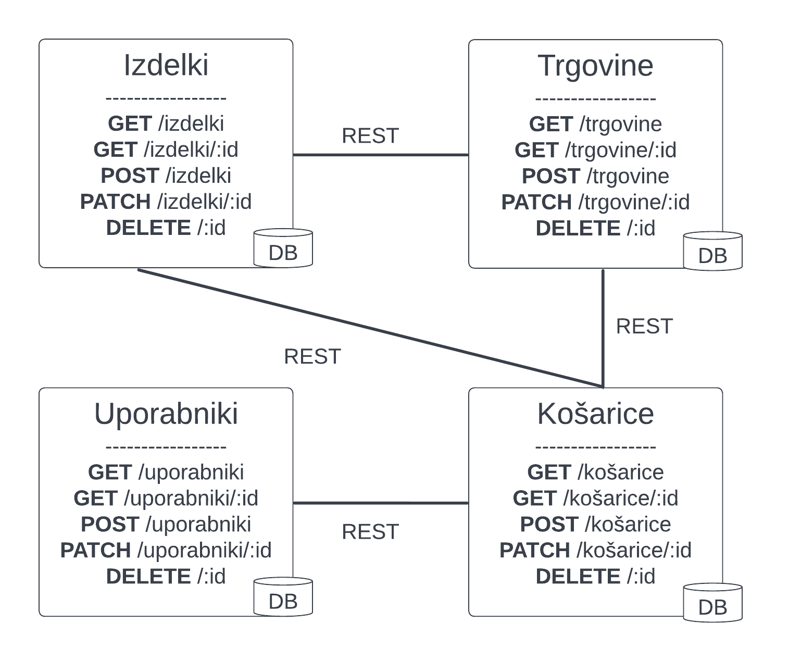

# Primerjalnik cen izdelkov

## Primeri uporabe 
- prikaz cen različnih izdelkov
- izračun in primerjava košarice nabora izdelkov po različnih trgovinah
- generiranje najcenejše košarice za izbrane izdelke
- izračun košarice priljubljenih izdelkov
- shranjevanje košarice izbranih izdelkov


## Shema interakcij med mikrostoritvami


### Zasnova vmesnikov spletnih storitev


### Primeri sporočil / podatkovnih objektov, ki jih bo obdelovala aplikacija

#### Izdelek
```json
{
    "id": 1,
    "title": "Moka",
    "brand": "Žito",
    "image": "https://...",
    "stores": {...},
    "prices": {...}
}
```

#### Trgovina
```json
{
    "id": 1,
    "title": "Lidl"
}
```

#### Uporabnik
```json
{
    "id": 1,
    "username": "ime",
    "password": "****",
    "email": "smth@smth.com"
}
```

#### Košarica
```json
{
    "id": 1,
    "user_id": 1,
    "products": {...}
}
```

## Kompleksnejši zahtevek
Pri zahtevku za košarico uporabnika bodo sodelovale storitve za *Košarice*, *Izdelke* in *Trgovine*.


